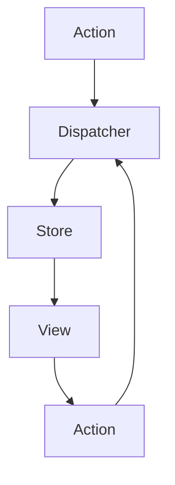
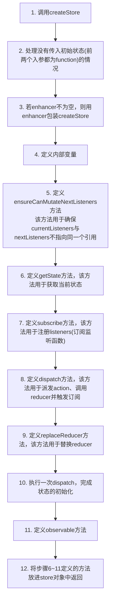
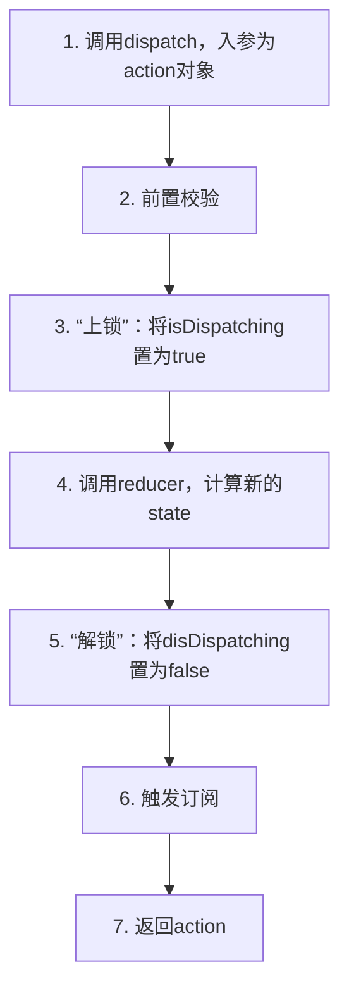

# Redux
Redux可以认为是Flux的一种实现形式，因为Redux在实现层面并没有按照Flux的规则来(Flux可以实现多个Store)
## 概念
### Flux
> 核心在于严格的单向数据流下，状态的变化是可预测的
1. View
用户界面
2. Action
视图层发出的消息，触发应用状态的改变
3. Dispatcher
对action进行分发
3. Store
存储应用状态的"仓库"，此外还会定义修改状态的逻辑

### 数据流

## 组成
- Store
单一数据源，只读
- Action
对变化的描述
- Reducer
负责对变化进行分发和处理，最终将新的数据返回给Store 


## 工作
### createStore

---
### dispatch

> 这里设置isDispatching是避免开发者在reducer中手动调用dispatch，避免死循环

### subscribe
1. 在store对象创建成功后
通过调用`store.subscribe`来注册监听函数
2. 当`dispatch action`发生时
Redux会在reducer执行完毕后将listeners数组中的监听函数逐个执行

> 为什么需要currentListeners和nextListeners两个listeners数组
> currentListeners: 确保监听函数执行过程的稳定性
> nextListeners: 注册监听/触发订阅/取消监听 都是该数组


### 中间件
```
import { createStore, applyMiddleware } from 'redux';
...
const store = createStore(
  reducer,
  initial_state,
  applyMiddleware(middleware1, middleware2,...);
)
```