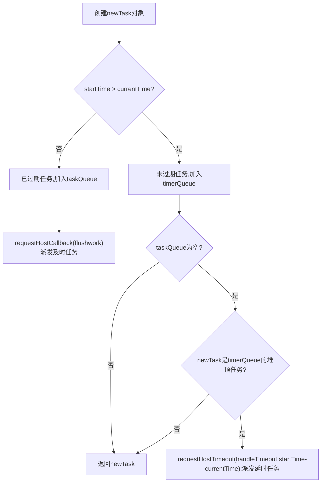

# React Fiber

## 渲染过程
- legacy(同步)
ReactDOM.render(<App />, rootNode)
- blocking
ReactDOM.createBlockingRoot(rootNode).render(<App />)
- concurrent(异步)
ReactDOM.createRoot(rootNode).render(<App />)
## ReactDOM.render
> 首次渲染是同步过程
### 初始化
### render
构建Fiber树，其工作目标是：找出界面中需要处理的更新
这里又可以区分为：
1. 挂载阶段(current为空)
2. 更新阶段(current不为空)
> flags/effectTag记录的是**副作用**的类型
> 副作用：数据获取、订阅或者修改DOM等操作
1. 创建workInProgress节点
> workInProgress就是rootFiber的副本
2. workInProgress节点不为空，调用`beginWork`，实现对新Fiber节点的创建
> Fiber节点创建过程
> - `beginWork`
> - updateHostRoot,进入rootFiber节点的处理逻辑
> - 调用reconcileChildren,分发当前节点(此处为rootFiber节点)的子节点(此处为App节点)的创建逻辑
> - Current不为null，逻辑因此被分发进reconcileChildFibers,reconcileChildFibers是ChildReconciler(true)的返回值，这意味着副作用将被追踪
> - reconcileChildFibers将子节点的创建逻辑分发给reconcileSingleElement，得到App FiberNode
> - 调用placeSingleChild，为App FiberNode打上"Placement"(新增)的标识
> - App FiberNode作为rootFiber的child的属性，与现有workInProgress Fiber树建立关联
3. 当`beginWork`返回null时，说明遍历到叶子节点，递归中的`递`完成，开始`归`，即`completeWork`
> - `completeWork`(负责处理Fiber节点到DOM节点的映射逻辑)(自底向上执行)
> 1. 创建DOM节点(CreateInstance)
> 2. 将DOM节点插入到DOM树中(AppendAllChildren)
> 3. 为DOM节点设置属性(FinalizeInitialChildren)
将Fiber节点映射为DOM节点
### commit
commit是一个同步的过程
#### 工作流
- before mutation
DOM节点还没有渲染到界面上
- mutation
负责DOM节点的渲染
- layout
处理DOM渲染完毕之后的收尾逻辑，还会把fiberRoot的current指针指向workInProgress Fiber树

## Concurrent
### 时间切片
#### 优先级调度

### 优先级

## 概念
### Fiber节点关系
- return
父节点
- child
子节点
- sibling
兄弟节点
### effectList(副作用链)
可以理解为render阶段工作成果的合集，是对视图更新追踪的手段
  - 都是当前Fiber节点的后代节点
  - 都有待处理的副作用
> Fiber节点的effectList里记录是其需要更新的后代节点
#### 实现
  - firstEffect
  - lastEffect
## beginWork
## completeWork